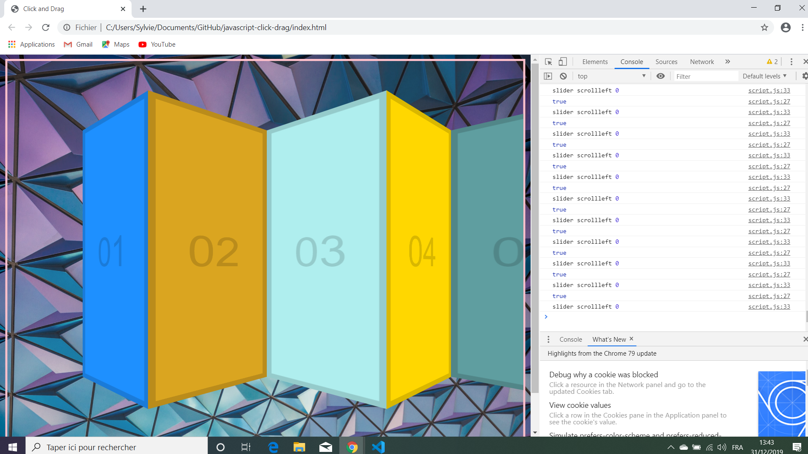

# Javascript Click Drag

Wes Bos Youtube Tutorial: [JavaScript Interface Challenge: Click and Drag to Scroll - #JavaScript30 27/30](https://www.youtube.com/watch?v=C9EWifQ5xqA&index=27&list=PLu8EoSxDXHP6CGK4YVJhL_VWetA865GOH).


*** Note: to open web links in a new window use: _ctrl+click on link_**

## Table of contents

* [General info](#general-info)
* [Screenshots](#screenshots)
* [Technologies](#technologies)
* [Setup](#setup)
* [Features](#features)
* [Status](#status)
* [Inspiration](#inspiration)
* [Contact](#contact)

## General info

* Tutorial Code to scroll horizontally using click and drag.

## Screenshots

.

## Technologies

* [Javascript v1.9 ECMA-262 ECMAScript 2018](http://www.ecma-international.org/publications/standards/Ecma-262.htm)

## Setup

* Open index.html in browser. If any code is changed the browser needs to be refreshed.

## Code Examples

* calculate slider scroll left value from cursor position and 

```javascript
slider.addEventListener('mousemove', (e) => {
  if (!isDown) return; //stop the function from running
  console.log(isDown);
  e.preventDefault(); // prevent selection of text etc inside area.
  const x = e.pageX - slider.offsetLeft;
  const scrollMultiple = 3; // scroll 3 pixels for each pixel moved by the mouse.
  const walk = (x - startX)*scrollMultiple;
  slider.scrollLeft = scrollLeft - walk;
  console.log('slider scrollleft', slider.scrollLeft); //max value 4207.2001953125
});
```

## Features

*  scroll speed can be changed.

## Status & To-Do List

* Status: Working.

* To-Do: Nothing

## Inspiration

* Wes Bos Youtube Tutorial: [JavaScript Interface Challenge: Click and Drag to Scroll - #JavaScript30 27/30](https://www.youtube.com/watch?v=C9EWifQ5xqA&index=27&list=PLu8EoSxDXHP6CGK4YVJhL_VWetA865GOH).

## Contact

Repo created by [ABateman](https://www.andrewbateman.org) - feel free to contact me!
